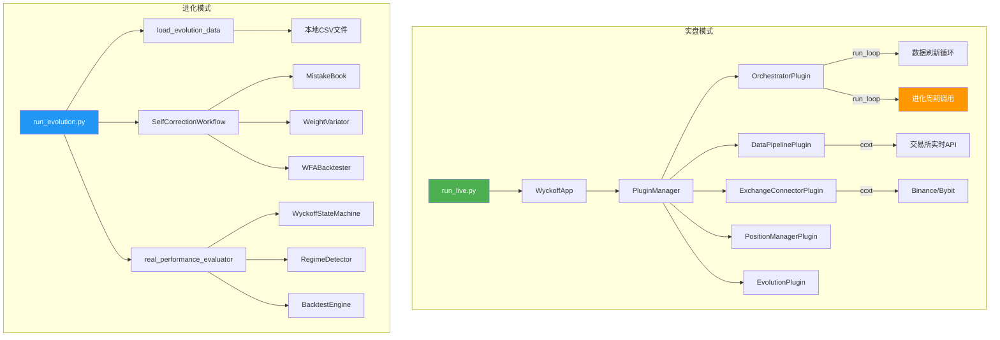

# 威科夫系统：实盘 vs 进化 架构分离分析

> 分析日期：2026-03-19
> 修复日期：2026-03-19
> 分析范围：入口文件、编排器、仓位管理、事件总线、数据源、配置系统

## 1. 总体结论

**实盘和进化两个子系统已完全分离。此前存在的混合问题已修复。**

| 维度 | 隔离状态 | 风险等级 |
|------|----------|----------|
| 入口文件 | ✅ 完全分离 | 无风险 |
| 架构路径 | ✅ 完全不同 | 无风险 |
| Orchestrator | ✅ 已清理（进化逻辑已移除） | 无风险 |
| 仓位管理 | ✅ 天然隔离 | 无风险 |
| 事件总线 | ✅ 天然隔离 | 无风险 |
| 数据源 | ✅ 完全分离 | 无风险 |
| 配置系统 | ✅ 已清理（进化配置已从编排器移除） | 无风险 |

## 2. 当前架构分离现状图

## 3. 逐项分析

### 3.1 入口分离 — ✅ 完全分离

**实盘入口** [`run_live.py`](../run_live.py):
- 使用 [`WyckoffApp`](../src/app.py:31) 插件化架构
- 调用 `app.start()` → `app.run_loop()` → 委托给 `OrchestratorPlugin.run_loop()`
- 加载**所有14个插件**，包括 `exchange_connector`、`data_pipeline` 等
- 数据来源：通过 `DataPipelinePlugin` 从交易所 API 实时获取

**进化入口** [`run_evolution.py`](../run_evolution.py):
- **完全独立脚本**，不使用 `WyckoffApp`，不加载任何插件
- 直接导入底层类：`WyckoffStateMachine`、`RegimeDetector`、`BacktestEngine` 等
- 自行构建 `SelfCorrectionWorkflow` 实例
- 数据来源：从 `data/` 目录读取本地 CSV 文件
- 运行同步的 `while True` 无限循环

**结论**：两个入口使用完全不同的架构路径，不存在混合问题。

### 3.2 Orchestrator — ✅ 已清理

此前 [`OrchestratorPlugin.run_loop()`](../src/plugins/orchestrator/plugin.py:472) 中包含进化周期调用逻辑，已在 2026-03-19 修复中移除。

**修复内容**：
- 移除 `run_evolution_cycle()` 方法
- 移除 `run_loop()` 中的进化周期定时调用
- 移除 `_evolution_count` 字段及其在 `get_system_status()`、`get_statistics()`、`health_check()` 中的引用
- 移除 `plugin-manifest.yaml` 中对 `evolution` 插件的依赖和 `orchestrator.evolution_cycle_completed` 事件
- 移除 `config.yaml` 中编排器的 `evolution_interval` 配置

**结论**：Orchestrator 现在是纯粹的实盘交易协调器，不包含任何进化逻辑。

### 3.3 仓位管理隔离 — ✅ 天然隔离

[`PositionManagerPlugin`](../src/plugins/position_manager/plugin.py:14) 分析：

- **实盘模式**：通过插件系统加载，监听 `trading.signal` 和 `market.price_update` 事件
- **进化模式**：[`run_evolution.py`](../run_evolution.py) **完全不使用** `PositionManagerPlugin`
  - 进化模式使用独立的 [`BacktestEngine`](../src/backtest/engine.py) 进行模拟交易
  - `BacktestEngine` 有自己的内部仓位跟踪，与 `PositionManager` 无关

**结论**：进化模式的模拟交易**不可能**影响实盘仓位，因为它们使用完全不同的组件。

### 3.4 事件总线隔离 — ✅ 天然隔离

- **实盘模式**：使用 [`WyckoffApp`](../src/app.py:31) 内部的 [`EventBus`](../src/kernel/event_bus.py) 实例
- **进化模式**：[`run_evolution.py`](../run_evolution.py) **不创建** `EventBus`，不使用事件驱动架构
- 两个进程运行在不同的 Python 进程中，内存空间完全隔离

**结论**：事件总线不存在交叉污染的可能性。

### 3.5 数据源隔离 — ✅ 完全分离

| 维度 | 实盘模式 | 进化模式 |
|------|----------|----------|
| 数据来源 | 交易所 API via ccxt | 本地 CSV 文件 |
| 数据管道 | `DataPipelinePlugin` | `load_evolution_data()` 函数 |
| 数据格式 | 实时 OHLCV | 历史 OHLCV |
| 刷新方式 | 定时轮询 60s | 一次性加载 |

### 3.6 配置系统 — ✅ 已清理

此前 `config.yaml` 中存在 `evolution_interval: 3600` 配置，在实盘模式下被编排器读取。

**修复内容**：
- 移除顶层 `evolution_interval` 配置
- 移除 `plugins.orchestrator.evolution_interval` 配置

**结论**：编排器配置中不再包含任何进化相关参数。`run_evolution.py` 自行管理进化配置，不依赖 `config.yaml`。

## 4. 已修复的问题列表

### ✅ 问题 1：OrchestratorPlugin.run_loop 混合进化逻辑（已修复）

- **位置**：[`src/plugins/orchestrator/plugin.py`](../src/plugins/orchestrator/plugin.py)
- **修复**：移除 `run_evolution_cycle()` 方法、`_evolution_count` 字段、`run_loop()` 中的进化调用
- **修复日期**：2026-03-19

### ✅ 问题 4：配置文件无模式区分（已修复）

- **位置**：[`config.yaml`](../config.yaml)
- **修复**：移除顶层和插件级别的 `evolution_interval` 配置
- **修复日期**：2026-03-19

## 5. 仍然存在的架构特征（非缺陷）

### 🟡 特征 1：run_evolution.py 绕过插件架构

- **位置**：[`run_evolution.py`](../run_evolution.py)
- **描述**：进化脚本直接导入底层类，不使用 `WyckoffApp` 和插件系统
- **影响**：存在两套并行的进化实现（脚本版 vs 插件版 `EvolutionPlugin`），维护成本高
- **当前风险**：中（代码重复，可能导致行为不一致）
- **建议**：未来可考虑统一进化入口，让 `run_evolution.py` 也使用 `WyckoffApp` + `EvolutionPlugin`

### 🟡 特征 2：EvolutionPlugin 存在但未被 run_evolution.py 使用

- **位置**：[`src/plugins/evolution/plugin.py`](../src/plugins/evolution/plugin.py:31)
- **描述**：`EvolutionPlugin` 有完整的进化循环实现，但 `run_evolution.py` 不使用它
- **影响**：两套进化逻辑可能随时间分叉，导致混乱
- **当前风险**：中
- **建议**：与特征 1 一并处理，统一进化入口

## 6. 后续可选改进

### 方案：统一进化入口（推荐的下一步）

1. 让 `run_evolution.py` 也使用 `WyckoffApp` + `EvolutionPlugin`
2. 通过配置区分模式：`system_mode: "live"` 或 `system_mode: "evolution"`
3. 根据模式决定加载哪些插件（进化模式不加载 `exchange_connector`）
4. 删除 `run_evolution.py` 中的重复实现

## 7. 总结

**修复后状态**：

> 实盘和进化在代码层面和运行时均已**完全隔离**。
> 
> Orchestrator 不再包含任何进化逻辑，配置文件中也不再有编排器层面的进化参数。
> 进化逻辑完全由 `EvolutionPlugin` 和 `run_evolution.py` 独立管理。
> 
> 剩余的架构特征（两套并行进化实现）不影响实盘安全性，
> 但建议未来统一进化入口以减少维护成本。

---

*本文档由架构分析自动生成，分析日期：2026-03-19*
*修复完成日期：2026-03-19*
