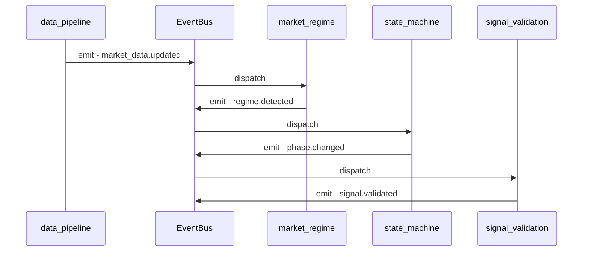
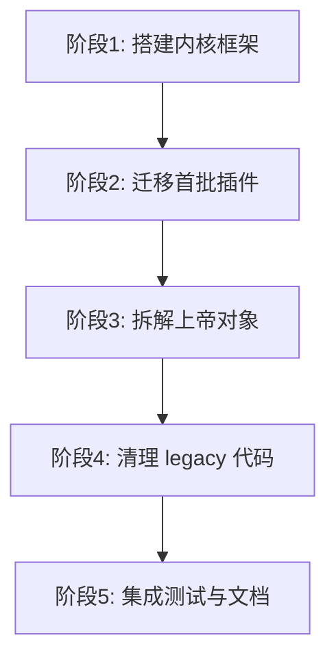

# 威科夫引擎插件化架构重构方案

## 第一部分：新目录结构与插件分类

### 1. 当前问题诊断

| 问题 | 具体表现 |
|------|----------|
| 上帝对象 | `system_orchestrator_legacy.py` 109K字符，`wyckoff_state_machine_legacy.py` 145K字符 |
| 模块堆砌 | `src/core/` 下 20+ 个 .py 文件平铺，无分层 |
| 僵尸代码 | `_legacy` 后缀文件未清理，新旧并存 |
| 硬编码依赖 | 模块间直接 import，无注册/发现机制 |
| 无错误隔离 | 任一模块异常可拖垮整个系统 |

### 2. 新目录结构

```
wyckoff/
├── src/
│   ├── kernel/                    # 内核层 - 不可插件化的核心
│   │   ├── __init__.py
│   │   ├── plugin_manager.py      # 插件管理器
│   │   ├── base_plugin.py         # 插件基类
│   │   ├── plugin_manifest.py     # Manifest 解析器
│   │   ├── event_bus.py           # 事件总线 - 替代硬编码依赖
│   │   ├── config_system.py       # 全局配置系统
│   │   └── types.py               # 共享类型定义
│   │
│   ├── plugins/                   # 插件目录 - 每个子目录一个插件
│   │   ├── market_regime/         # 市场体制检测插件
│   │   │   ├── plugin-manifest.yaml
│   │   │   ├── __init__.py
│   │   │   └── detector.py
│   │   │
│   │   ├── wyckoff_state_machine/ # 威科夫状态机插件
│   │   │   ├── plugin-manifest.yaml
│   │   │   ├── __init__.py
│   │   │   ├── state_machine.py
│   │   │   ├── evidence_chain.py
│   │   │   └── state_definitions.py
│   │   │
│   │   ├── data_pipeline/         # 数据管道插件
│   │   │   ├── plugin-manifest.yaml
│   │   │   ├── __init__.py
│   │   │   ├── pipeline.py
│   │   │   └── sanitizer.py
│   │   │
│   │   ├── risk_management/       # 风险管理插件
│   │   │   ├── plugin-manifest.yaml
│   │   │   ├── __init__.py
│   │   │   ├── circuit_breaker.py
│   │   │   └── anomaly_validator.py
│   │   │
│   │   ├── signal_validation/     # 信号验证插件
│   │   │   ├── plugin-manifest.yaml
│   │   │   ├── __init__.py
│   │   │   ├── breakout_validator.py
│   │   │   ├── micro_entry_validator.py
│   │   │   └── conflict_resolver.py
│   │   │
│   │   ├── pattern_detection/     # 形态检测插件
│   │   │   ├── plugin-manifest.yaml
│   │   │   ├── __init__.py
│   │   │   ├── tr_detector.py
│   │   │   ├── wyckoff_phase_detector.py
│   │   │   └── curve_boundary.py
│   │   │
│   │   ├── perception/            # 市场感知插件
│   │   │   ├── plugin-manifest.yaml
│   │   │   ├── __init__.py
│   │   │   ├── candle_physical.py
│   │   │   ├── fvg_detector.py
│   │   │   └── pin_body_analyzer.py
│   │   │
│   │   ├── evolution/             # 自动进化插件
│   │   │   ├── plugin-manifest.yaml
│   │   │   ├── __init__.py
│   │   │   ├── operators.py
│   │   │   ├── weight_variator.py
│   │   │   ├── wfa_backtester.py
│   │   │   └── evolution_archivist.py
│   │   │
│   │   ├── monitoring/            # 监控插件
│   │   │   ├── plugin-manifest.yaml
│   │   │   ├── __init__.py
│   │   │   ├── performance_monitor.py
│   │   │   ├── mistake_book.py
│   │   │   └── decision_visualizer.py
│   │   │
│   │   ├── backtest/              # 回测插件
│   │   │   ├── plugin-manifest.yaml
│   │   │   ├── __init__.py
│   │   │   ├── engine.py
│   │   │   └── reporter.py
│   │   │
│   │   ├── web_dashboard/         # Web仪表盘插件
│   │   │   ├── plugin-manifest.yaml
│   │   │   ├── __init__.py
│   │   │   ├── dashboard.py
│   │   │   └── web_dashboard.py
│   │   │
│   │   └── agent_system/          # Agent系统插件
│   │       ├── plugin-manifest.yaml
│   │       ├── __init__.py
│   │       ├── base_agent.py
│   │       ├── orchestrator.py
│   │       └── ...
│   │
│   └── utils/                     # 工具函数 - 保持不变
│       ├── __init__.py
│       ├── config_loader.py
│       ├── error_handler.py
│       └── visualizer.py
│
├── tests/                         # 测试目录 - 镜像插件结构
│   ├── kernel/
│   └── plugins/
│       ├── test_market_regime/
│       ├── test_data_pipeline/
│       └── ...
│
├── config.yaml                    # 全局配置
└── run_live.py                    # 入口文件
```

### 3. 插件分类表

| 插件名 | 类型 | 来源文件 | 依赖 |
|--------|------|----------|------|
| market_regime | core | market_regime.py | 无 |
| wyckoff_state_machine | core | wyckoff_state_machine_legacy.py + wyckoff_state_machine/ | market_regime |
| data_pipeline | core | data_pipeline.py, data_sanitizer.py | 无 |
| risk_management | core | circuit_breaker.py, anomaly_validator.py | market_regime |
| signal_validation | core | breakout_validator.py, micro_entry_validator.py, conflict_resolver.py | market_regime, data_pipeline |
| pattern_detection | core | tr_detector.py, wyckoff_phase_detector.py, curve_boundary.py | data_pipeline |
| perception | core | candle_physical.py, fvg_detector.py, pin_body_analyzer.py | 无 |
| evolution | optional | evolution/, weight_variator.py, wfa_backtester.py, evolution_archivist.py | data_pipeline, backtest |
| monitoring | optional | performance_monitor.py, mistake_book.py, decision_visualizer.py | 无 |
| backtest | optional | backtest/ | data_pipeline |
| web_dashboard | optional | visualization/ | monitoring |
| agent_system | optional | agents/ | 全部 |

> **core** = 系统启动必须加载；**optional** = 可按需启用/禁用

---

*下一部分将定义上帝对象拆解方案和实施步骤*

---

## 第二部分：plugin-manifest.yaml 规范与 BasePlugin 接口

### 4. plugin-manifest.yaml 规范

每个插件目录下必须包含一个 `plugin-manifest.yaml` 文件，格式如下：

```yaml
# 示例：market_regime 插件的 manifest
manifest_version: "1.0"

# 基本信息
name: "market_regime"
display_name: "市场体制检测器"
version: "1.0.0"
description: "基于ATR/ADX/波动率的市场体制检测"
author: "wyckoff-team"

# 插件类型：core | optional
plugin_type: "core"

# 入口点：相对于插件目录的 Python 模块路径
entry_point: "detector.RegimeDetector"

# 依赖的其他插件（按 name 引用）
dependencies: []

# 插件提供的能力
capabilities:
  - "regime_detection"
  - "volatility_analysis"

# 事件订阅：本插件监听哪些事件
subscriptions:
  - "market_data.updated"

# 事件发布：本插件会发出哪些事件
publications:
  - "regime.changed"
  - "regime.detected"

# 配置 schema
config_schema:
  atr_period:
    type: "int"
    default: 14
    description: "ATR计算周期"
  adx_period:
    type: "int"
    default: 14
    description: "ADX计算周期"
  volatility_window:
    type: "int"
    default: 20
    description: "波动率计算窗口"

# 健康检查配置
health_check:
  enabled: true
  interval_seconds: 60
  timeout_seconds: 10
```

#### Manifest 字段说明

| 字段 | 必填 | 类型 | 说明 |
|------|------|------|------|
| manifest_version | 是 | string | Manifest 格式版本，当前 "1.0" |
| name | 是 | string | 插件唯一标识符，snake_case |
| display_name | 是 | string | 显示名称 |
| version | 是 | string | 语义化版本号 |
| plugin_type | 是 | string | "core" 或 "optional" |
| entry_point | 是 | string | 入口类路径，格式 "module.ClassName" |
| dependencies | 否 | list | 依赖的其他插件 name 列表 |
| capabilities | 否 | list | 提供的能力标签 |
| subscriptions | 否 | list | 订阅的事件列表 |
| publications | 否 | list | 发布的事件列表 |
| config_schema | 否 | dict | 配置项定义 |
| health_check | 否 | dict | 健康检查配置 |

#### 禁用插件

参考 VCP 的 `.block` 机制：将 `plugin-manifest.yaml` 重命名为 `plugin-manifest.yaml.disabled` 即可禁用插件，无需删除任何代码。

### 5. BasePlugin 抽象基类

```python
from abc import ABC, abstractmethod
from typing import Dict, Any, Optional
from enum import Enum

class PluginState(Enum):
    """插件状态枚举"""
    UNLOADED = "unloaded"
    LOADING = "loading"
    ACTIVE = "active"
    ERROR = "error"
    DISABLED = "disabled"

class BasePlugin(ABC):
    """所有插件必须继承的基类
    
    生命周期：UNLOADED -> LOADING -> ACTIVE -> UNLOADED
    异常时：  任意状态 -> ERROR
    """
    
    def __init__(self, manifest: Dict, config: Dict[str, Any]) -> None:
        self.manifest = manifest
        self.config = config
        self.state = PluginState.UNLOADED
        self._event_bus = None  # 由 PluginManager 注入
    
    @abstractmethod
    def on_load(self) -> None:
        """插件加载时调用 - 初始化资源"""
        ...
    
    @abstractmethod
    def on_unload(self) -> None:
        """插件卸载时调用 - 释放资源"""
        ...
    
    def on_config_update(self, new_config: Dict[str, Any]) -> None:
        """配置热更新回调 - 可选覆盖"""
        self.config = new_config
    
    def health_check(self) -> Dict[str, Any]:
        """健康检查 - 可选覆盖"""
        return {"status": "healthy", "plugin": self.manifest["name"]}
    
    def emit_event(self, event_name: str, data: Any = None) -> None:
        """发布事件到事件总线"""
        if self._event_bus:
            self._event_bus.emit(event_name, data, source=self.manifest["name"])
```

### 6. PluginManager 核心设计

```python
class PluginManager:
    """插件管理器 - 系统核心
    
    职责：
    1. 扫描 plugins/ 目录发现插件
    2. 解析 manifest 并验证
    3. 按依赖顺序加载插件
    4. 错误隔离 - 单个插件异常不影响其他插件
    5. 提供插件查询和管理 API
    """
    
    def __init__(self, plugins_dir: str, config: Dict) -> None: ...
    
    # 生命周期
    def discover_plugins(self) -> List[Dict]: ...
    def load_plugin(self, name: str) -> bool: ...
    def unload_plugin(self, name: str) -> bool: ...
    def reload_plugin(self, name: str) -> bool: ...
    def load_all(self) -> Dict[str, bool]: ...
    
    # 查询
    def get_plugin(self, name: str) -> Optional[BasePlugin]: ...
    def list_plugins(self) -> List[Dict]: ...
    def get_plugin_state(self, name: str) -> PluginState: ...
    
    # 管理
    def enable_plugin(self, name: str) -> bool: ...
    def disable_plugin(self, name: str) -> bool: ...
    
    # 健康检查
    def health_check_all(self) -> Dict[str, Dict]: ...
```

### 7. EventBus 事件总线

替代硬编码 import 依赖，插件间通过事件通信：

```python
class EventBus:
    """事件总线 - 插件间解耦通信"""
    
    def subscribe(self, event: str, handler: Callable) -> None: ...
    def unsubscribe(self, event: str, handler: Callable) -> None: ...
    def emit(self, event: str, data: Any, source: str) -> None: ...
    def emit_async(self, event: str, data: Any, source: str) -> None: ...
```

#### 事件流示意



### 8. 错误隔离机制

```python
def _safe_call(self, plugin: BasePlugin, method: str, *args) -> Any:
    """安全调用插件方法，捕获异常不传播"""
    try:
        return getattr(plugin, method)(*args)
    except Exception as e:
        logger.error(
            "插件 %s 方法 %s 异常: %s",
            plugin.manifest["name"], method, e
        )
        plugin.state = PluginState.ERROR
        self._event_bus.emit(
            "plugin.error",
            {"plugin": plugin.manifest["name"], "error": str(e)},
            source="plugin_manager"
        )
        return None
```

每个插件的方法调用都通过 `_safe_call` 包装，确保：
- 单个插件崩溃不会拖垮整个系统
- 异常被记录到日志
- 插件状态自动标记为 ERROR
- 通过事件总线通知监控系统

---

## 第三部分：上帝对象拆解方案与分阶段实施步骤

### 9. 上帝对象拆解方案

#### 9.1 system_orchestrator_legacy.py 拆解

当前包含 6 个类，109K 字符：

| 原始类 | 目标位置 | 说明 |
|--------|----------|------|
| `SystemMode` | `src/kernel/types.py` | 系统模式枚举，属于内核共享类型 |
| `TradingSignal` | `src/kernel/types.py` | 交易信号枚举 |
| `WyckoffSignal` | `src/kernel/types.py` | 威科夫信号枚举 |
| `DecisionContext` | `src/kernel/types.py` | 决策上下文数据类 |
| `TradingDecision` | `src/kernel/types.py` | 交易决策数据类 |
| `SystemOrchestrator` | 拆分为多个插件协调逻辑 | 见下方详细拆分 |

**SystemOrchestrator 拆分策略**：

```
SystemOrchestrator - 当前上帝对象
├── 数据获取逻辑      → data_pipeline 插件
├── 市场分析逻辑      → market_regime + pattern_detection 插件
├── 信号生成逻辑      → signal_validation 插件
├── 风险检查逻辑      → risk_management 插件
├── 决策执行逻辑      → src/kernel/decision_engine.py - 内核
└── 状态管理逻辑      → src/kernel/plugin_manager.py - 内核
```

拆分后，原 `SystemOrchestrator` 变为轻量级 **决策引擎**，仅负责：
1. 从 EventBus 接收各插件的分析结果
2. 汇总决策
3. 下发执行指令

#### 9.2 wyckoff_state_machine_legacy.py 拆解

当前包含 10 个类，145K 字符：

| 原始类 | 目标位置 | 说明 |
|--------|----------|------|
| `StateDirection` | `src/plugins/wyckoff_state_machine/types.py` | 状态方向枚举 |
| `StateTransitionType` | `src/plugins/wyckoff_state_machine/types.py` | 转换类型枚举 |
| `StateEvidence` | `src/plugins/wyckoff_state_machine/types.py` | 证据数据类 |
| `StateDetectionResult` | `src/plugins/wyckoff_state_machine/types.py` | 检测结果数据类 |
| `StateTransition` | `src/plugins/wyckoff_state_machine/types.py` | 转换记录数据类 |
| `StatePath` | `src/plugins/wyckoff_state_machine/types.py` | 并行路径数据类 |
| `StateConfig` | `src/plugins/wyckoff_state_machine/config.py` | 状态机配置 |
| `WyckoffStateMachine` | `src/plugins/wyckoff_state_machine/state_machine.py` | 核心状态机 |
| `EnhancedWyckoffStateMachine` | 合并到 `state_machine.py` | 增强版合并到主类 |
| `EvidenceChainManager` | `src/plugins/wyckoff_state_machine/evidence_chain.py` | 证据链管理 |

#### 9.3 weight_variator_legacy.py 拆解

当前包含 5 个类，37K 字符：

| 原始类 | 目标位置 | 说明 |
|--------|----------|------|
| `MutationType` | `src/plugins/evolution/types.py` | 变异类型枚举 |
| `MutationOperator` | `src/plugins/evolution/operators.py` | 变异算子基类 |
| `ThresholdMutationOperator` | `src/plugins/evolution/operators.py` | 阈值变异算子 |
| `WeightMutationOperator` | `src/plugins/evolution/operators.py` | 权重变异算子 |
| `WeightVariator` | `src/plugins/evolution/weight_variator.py` | 权重变异器 |

### 10. 兼容性过渡层

为确保现有测试通过，在迁移期间保留兼容性 shim：

```python
# src/core/system_orchestrator.py - 过渡期保留
"""兼容性过渡层 - 重定向旧导入路径到新位置"""
import warnings

def __getattr__(name):
    warnings.warn(
        f"从 src.core.system_orchestrator 导入 {name} 已弃用，"
        f"请使用新路径",
        DeprecationWarning,
        stacklevel=2
    )
    # 重定向到新位置
    if name in _TYPE_NAMES:
        from src.kernel import types
        return getattr(types, name)
    raise AttributeError(f"module has no attribute {name}")
```

### 11. 分阶段实施步骤



#### 阶段 1：搭建内核框架

| 步骤 | 内容 | 验证方式 |
|------|------|----------|
| 1.1 | 创建 `src/kernel/` 目录和 `__init__.py` | 目录存在 |
| 1.2 | 实现 `base_plugin.py` — BasePlugin 抽象基类 | 单元测试 |
| 1.3 | 实现 `plugin_manifest.py` — YAML manifest 解析器 | 单元测试 |
| 1.4 | 实现 `event_bus.py` — 事件总线 | 单元测试 |
| 1.5 | 实现 `plugin_manager.py` — 插件管理器 | 单元测试 |
| 1.6 | 实现 `types.py` — 从 legacy 提取共享类型 | 现有测试通过 |
| 1.7 | 创建 `src/plugins/` 目录结构 | 目录存在 |

#### 阶段 2：迁移首批插件（低风险模块）

| 步骤 | 内容 | 验证方式 |
|------|------|----------|
| 2.1 | 迁移 `market_regime` → 插件 | 现有测试通过 |
| 2.2 | 迁移 `data_pipeline` → 插件 | 现有测试通过 |
| 2.3 | 迁移 `perception` 模块 → 插件 | 现有测试通过 |
| 2.4 | 为每个插件创建 `plugin-manifest.yaml` | manifest 验证通过 |
| 2.5 | 添加兼容性 shim 保持旧导入路径可用 | `pytest tests/ -v` 全通过 |

#### 阶段 3：拆解上帝对象

| 步骤 | 内容 | 验证方式 |
|------|------|----------|
| 3.1 | 提取共享类型到 `src/kernel/types.py` | 导入测试 |
| 3.2 | 拆解 `SystemOrchestrator` 为决策引擎 + 插件 | 现有测试通过 |
| 3.3 | 拆解 `WyckoffStateMachine` 到插件目录 | 现有测试通过 |
| 3.4 | 拆解 `WeightVariator` 到 evolution 插件 | 现有测试通过 |
| 3.5 | 迁移剩余模块为插件 | 全部测试通过 |

#### 阶段 4：清理 legacy 代码

| 步骤 | 内容 | 验证方式 |
|------|------|----------|
| 4.1 | 确认所有功能已迁移到新位置 | 功能对比检查 |
| 4.2 | 将兼容性 shim 中的 import 全部指向新路径 | 测试通过 |
| 4.3 | 删除 `*_legacy.py` 文件 | 测试通过 |
| 4.4 | 清理 `src/core/` 下已迁移的模块 | 测试通过 |
| 4.5 | 更新 `run_live.py` 和 `run_dashboard.py` | 系统可启动 |

#### 阶段 5：集成测试与文档

| 步骤 | 内容 | 验证方式 |
|------|------|----------|
| 5.1 | 运行完整测试套件 `pytest tests/ -v` | 全部通过 |
| 5.2 | 运行 `health_check.py` 验证系统健康 | 健康报告正常 |
| 5.3 | 编写插件开发指南 | 文档完成 |
| 5.4 | 更新 `AGENTS.md` 适配新架构 | 文档完成 |
| 5.5 | 更新 `README.md` | 文档完成 |

### 12. 风险控制

| 风险 | 缓解措施 |
|------|----------|
| 迁移过程中测试失败 | 每步迁移后立即运行测试，失败则回退 |
| 循环依赖 | 通过 EventBus 解耦，types.py 放在 kernel 层 |
| 性能退化 | EventBus 使用同步调用，避免不必要的序列化开销 |
| 旧代码引用断裂 | 兼容性 shim 层保持旧路径可用，逐步迁移 |
| 配置格式变更 | 保持 config.yaml 向后兼容，新增 plugins 配置节 |

---

*计划文档完成。三部分内容：*
1. *目录结构与插件分类*
2. *Manifest 规范与接口设计*
3. *上帝对象拆解与实施步骤*
